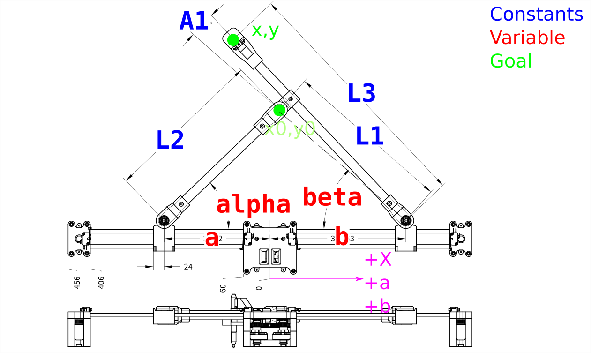

# aplotter_ros2
Pen Plotter using ODrive motor control and ROS2

This repository is dependend on a ROS2 CAN ODrive package found at https://github.com/camrbuss/ros2_odrive_can


## Inverse Kinematics



Use the Law of Cosines to solve the forward kinematics

$$\beta(t) = \arccos{\left(\frac{L_{1}^{2} - L_{2}^{2} + \left(- a{\left(t \right)} + b{\left(t \right)}\right)^{2}}{2 L_{1} \left(- a{\left(t \right)} + b{\left(t \right)}\right)} \right)}$$

$$x(t) = b{\left(t \right)} - L_{3} \cos{\left(A_{1} + \beta(t) \right)}$$

$$y(t) = L_{3} \sin{\left(A_{1} + \beta(t) \right)}$$

Take the derivative of x and y with respect to time

$$\frac{d}{d t} x{\left(t \right)} = \frac{L_{3} \left(\frac{d}{d t} a{\left(t \right)} - \frac{d}{d t} b{\left(t \right)}\right) \left(- L_{1}^{2} + L_{2}^{2} + \left(a{\left(t \right)} - b{\left(t \right)}\right)^{2}\right) \sin{\left(A_{1} + \arccos{\left(\frac{- L_{1}^{2} + L_{2}^{2} - \left(a{\left(t \right)} - b{\left(t \right)}\right)^{2}}{2 L_{1} \left(a{\left(t \right)} - b{\left(t \right)}\right)} \right)} \right)}}{L_{1} \sqrt{\frac{4 L_{1}^{2} \left(a{\left(t \right)} - b{\left(t \right)}\right)^{2} - \left(L_{1}^{2} - L_{2}^{2} + \left(a{\left(t \right)} - b{\left(t \right)}\right)^{2}\right)^{2}}{L_{1}^{2} \left(a{\left(t \right)} - b{\left(t \right)}\right)^{2}}} \left(a{\left(t \right)} - b{\left(t \right)}\right)^{2}} + \frac{d}{d t} b{\left(t \right)}$$

$$\frac{d}{d t} y{\left(t \right)} = \frac{L_{3} \left(\frac{d}{d t} a{\left(t \right)} - \frac{d}{d t} b{\left(t \right)}\right) \left(- L_{1}^{2} + L_{2}^{2} + \left(a{\left(t \right)} - b{\left(t \right)}\right)^{2}\right) \cos{\left(A_{1} + \arccos{\left(\frac{- L_{1}^{2} + L_{2}^{2} - \left(a{\left(t \right)} - b{\left(t \right)}\right)^{2}}{2 L_{1} \left(a{\left(t \right)} - b{\left(t \right)}\right)} \right)} \right)}}{L_{1} \sqrt{\frac{4 L_{1}^{2} \left(a{\left(t \right)} - b{\left(t \right)}\right)^{2} - \left(L_{1}^{2} - L_{2}^{2} + \left(a{\left(t \right)} - b{\left(t \right)}\right)^{2}\right)^{2}}{L_{1}^{2} \left(a{\left(t \right)} - b{\left(t \right)}\right)^{2}}} \left(a{\left(t \right)} - b{\left(t \right)}\right)^{2}}$$

Make substitutions for like terms while leaving $\frac{d}{d t} a{(t )}$
and $\frac{d}{d t} b{(t )}$ un-substituted

$$j(t) = - L_{3} \left(L_{1}^{2} - L_{2}^{2} - a^{2}{\left(t \right)} + 2 a{\left(t \right)} b{\left(t \right)} - b^{2}{\left(t \right)}\right)$$
$$k(t) = A_{1} + \arccos{\left(\frac{L_{1}^{2} - L_{2}^{2} + \left(a{\left(t \right)} - b{\left(t \right)}\right)^{2}}{2 L_{1} \left(- a{\left(t \right)} + b{\left(t \right)}\right)} \right)}$$
$$l(t) = 2 L_{1} \sqrt{1 - \frac{\left(L_{1}^{2} - L_{2}^{2} + \left(a{\left(t \right)} - b{\left(t \right)}\right)^{2}\right)^{2}}{4 L_{1}^{2} \left(a{\left(t \right)} - b{\left(t \right)}\right)^{2}}} \left(a{\left(t \right)} - b{\left(t \right)}\right)^{2}$$

Further substitute

$$\frac{d}{d t} f{(t )} = \frac{j(t) \sin({k(t)})}{l(t)}$$

$$\frac{d}{d t} g{(t )} = \frac{j(t) \cos({k(t)})}{l(t)}$$

Factor out $\frac{d}{d t} a{(t )}$ and $\frac{d}{d t} b{(t )}$

$$\frac{d}{d t} x{(t )} =  \frac{d}{d t} a{(t )} f(t) + \frac{d}{d t} b{(t )} ( 1 - f(t))$$

$$\frac{d}{d t} y{(t )} =  + \frac{d}{d t} a{(t )} g(t) + \frac{d}{d t} b{(t )}  - g(t)$$

Transform into a Matrix form

$$\begin{bmatrix}
    \frac{d}{d t} x{(t )} \\ 
    \frac{d}{d t} y{(t )}
    \end{bmatrix}
    =
    \begin{bmatrix}
    f(t) & 1-f(t) \\ 
    g(t) & -g(t)
    \end{bmatrix}
    \begin{bmatrix}
    \frac{d}{d t} a{(t )} \\ 
    \frac{d}{d t} b{(t )}
    \end{bmatrix}$$

Take the inverse to solve for $\frac{d}{d t} a{(t )}$ and
$\frac{d}{d t} b{(t )}$

$$\begin{bmatrix}
    \frac{d}{d t} a{(t )} \\ 
    \frac{d}{d t} b{(t )}
    \end{bmatrix}
    =
    \begin{bmatrix}
    1 & -\frac{f(t)-1}{g(t)} \\
    1 & -\frac{f(t)}{g(t)} \\
    \end{bmatrix}
    \begin{bmatrix}
    \frac{d}{d t} x{(t )} \\ 
    \frac{d}{d t} y{(t )}
    \end{bmatrix}$$

Implement in C++ with a(t) and b(t) coming in as discrete measurements, x'(t) and y'(t) being set by the user, and a'(t) and b'(t) being sent to the motor controllers.

``` cpp
  float j = -L3 * (std::pow(L1, 2) - std::pow(L2, 2) - std::pow(a, 2) + 2.0 * a * b - std::pow(b, 2));
  float k = A1 + std::acos((1.0 / 2.0) * (std::pow(L1, 2) - std::pow(L2, 2) + std::pow(a - b, 2)) / (L1 * (-a + b)));
  float l = 2.0 * L1 * sqrt(1 - 1.0 / 4.0 * std::pow(std::pow(L1, 2) - std::pow(L2, 2) + std::pow(a - b, 2), 2) / (std::pow(L1, 2) * std::pow(a - b, 2))) * std::pow(a - b, 2);
  float f = j * std::sin(k) / l;
  float g = j * std::cos(k) / l;

  this->a_vel_setpoint_ = x_vel_ - ((-1.0f + f) * y_vel_ / g);
  this->b_vel_setpoint_ = x_vel_ - ((f * y_vel_) / g);
```

## Microsoft Xbox 360 Wired Controller for Linux Interface

The controls needed to  achieve velocity control are sequential. The left bumper correspond to axis 1 and the right bumber to axis 0.

| ID | Button Combination | Function |
|-|-|-|
| 1 | <Left/Right> Bumper + X | E-Stop |
| 2 | <Left/Right> Bumper + Y | Calibrate Axis |
| 3 | <Left/Right> Bumper + A | Request Closed Loop Control |
| 4 | <Left/Right> Bumper + B | Home Axis |
| 5 | <Left/Right> Bumper + Back | Clear Axis Error |
| 6 | Menu | Start Command Loop |
| 7 | <Left/Right> Bumper + D-Pad Left | Set Velocity Control Mode |
| 8 | D-Pad Up | Increment Max Velocity |
| 9 | D-Pad Down | Decrement Max Velocity |
| 10 | Left Joystick | X, Y Velocity Control |
| 11 | Left Joystick Button | Toggle Pen |

### Typical Sequence

1. ID2
2. ID3
3. ID4
4. ID4
5. ID7
6. ID6
7. ID10